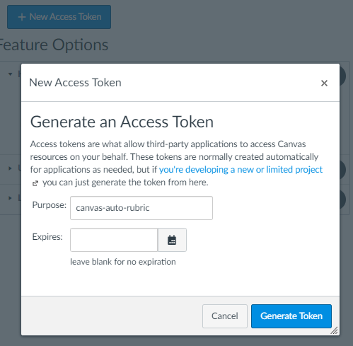
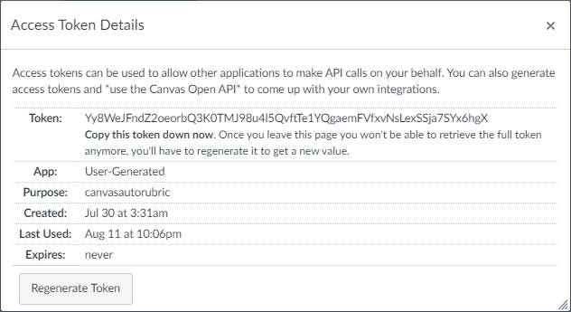
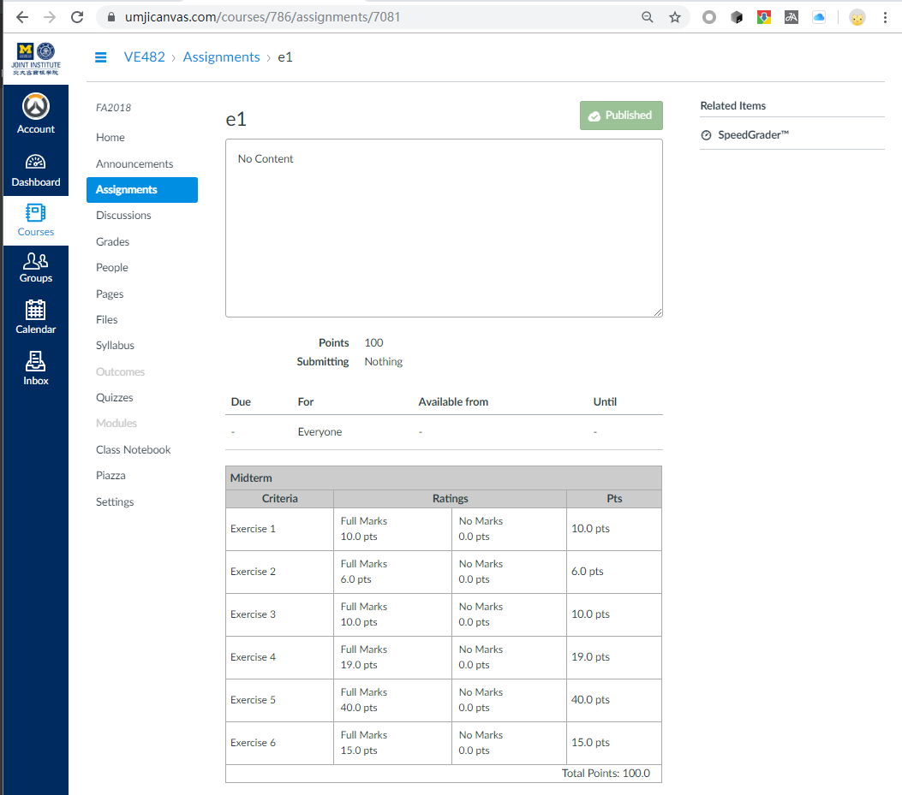
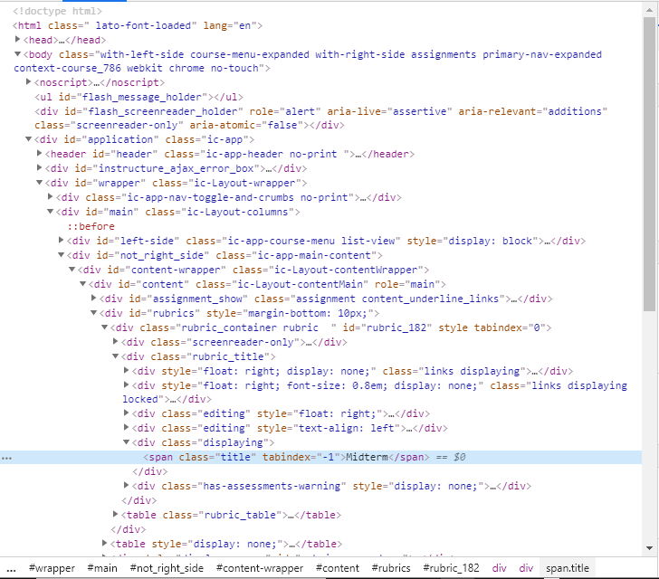

# Canvas Auto Rubric

## Installation

(choose one of these methods)

### Simple Usage

```bash
pip3 install git+https://github.com/tc-imba/canvas-auto-rubric.git@master
```

### Local Install or Debug

```bash
git clone git@github.com:tc-imba/canvas-auto-rubric.git
cd canvas-auto-rubric
# you can setup a virtual python env before install here
pip3 install -e .
```


## Usage

```
Usage: canvasautorubric [OPTIONS]

Options:
  -u, --api-url TEXT        The Canvas LMS API URL.  [default:
                            https://umjicanvas.com/]
  -k, --api-key TEXT        The Canvas LMS API KEY.  [required]
  -c, --course-id TEXT      The Course ID of the target.  [required]
  -a, --assignment-id TEXT  The Assignment ID of the target.  [required]
  -r, --rubric-id TEXT      The Rubric ID of the target.
  -i, --input-file FILENAME CSV file with grades.  [required]
  --no-sum                  Use the last row of the grade file as the total
                            grade.
  --header                  Use the first row of the grade file as
                            description.
  --no-comment              Do not add a update comment in the submission
                            comments.
  -h, --help                Show this message and exit.
  --version                 Show the version and exit.
```

Please **carefully** follow the steps listed below.

### Generate key (Access Token) on Canvas

The key can be generated in the `/profile/settings` webpage on canvas, for example, in UMJI, it is <a href="https://umjicanvas.com/profile/settings" target="_blank">https://umjicanvas.com/profile/settings</a>.

In the `Approved Integrations` section, use `New Access Token` to generate a key.



The generated key will be shown here.



It is `Yy8WeJFndZ2oeorbQ3K0TMJ98u4l5QvftTe1YQgaemFVfxvNsLexSSja7SYx6hgX`. Please keep this key secret, do not give to anyone else because it can provide the whole access to your canvas account. You need to save this key somewhere because

> Once you leave this page you won't be able to retrieve the full token anymore, you'll have to regenerate it to get a new value.

### Obtain Course ID, Assignment ID and Create a Rubric (with a Rubric ID)

Open the assignment you want to grade on canvas, you can easily find the Course ID and Assignment ID in the navbar. And you can then create a rubric (or select an existing one) on this page.



For example, the url is `https://umjicanvas.com/courses/786/assignments/7081`, so the Course ID is `786` and the Assignment ID is `7081`.

The way to get Rubric ID is a bit more tricky. Assuming that you are using Chrome, right click the name of the rubric and select `Chrome Devtools` (or `检查`, `审查元素`), the rubric id will be shown in the dev tools.



If you can't find out that the Rubric ID is `182`, please close this page and go to doctor. (CR. [Reapor-Yurnero](https://github.com/Reapor-Yurnero) when playing DoTA2
)

**If a rubric is just created and never used, this tool won't work. You can give a random score to any student in an assignment using this rubric in the SpeedGrader before running this tool. Don't worry about the random score because all scores will be updated after running this tool.**

### Input File Format

There is a `sample.csv`, of the data
```bash
3076,67.5,57.857,9,66.857
2337,69,57.294,8,65.294
2331,69,58.811,6,64.811
2743,67.5,54.427,10,64.427
584,70.5,56.272,8,64.272
3080,64.5,55.107,9,64.107
2983,70.5,56.272,5,61.272
2977,66,50.739,10,60.739
2693,60,52.126,8,60.126
3119,66,50.276,8,58.276
2808,66,51.94,6,57.94
2286,0,0,0,0
2649,0,0,0,0
```

The first column is the canvas uid, which can be found in the csv file exported from the `Grades` page.

The rest columns are the grades in the order of which the rubric defines.

The total grade of one student is the sum of these columns. If the `--no-sum` argument is passed, the last column will be the total grade instead.

If the you set the first row of the csv file as a header line, and the `--header` argument is passed, each of the header column will be a comment as a description.

### Sample Usage

```bash
canvasautorubric -u https://umjicanvas.com/ -k Yy8WeJFndZ2oeorbQ3K0TMJ98u4l5QvftTe1YQgaemFVfxvNsLexSSja7SYx6hgX -c 786 -a 7081 -r 182 -i sample.csv
```

## Licence

Apache 2.0

## Dependencies

+ click
+ canvasapi
