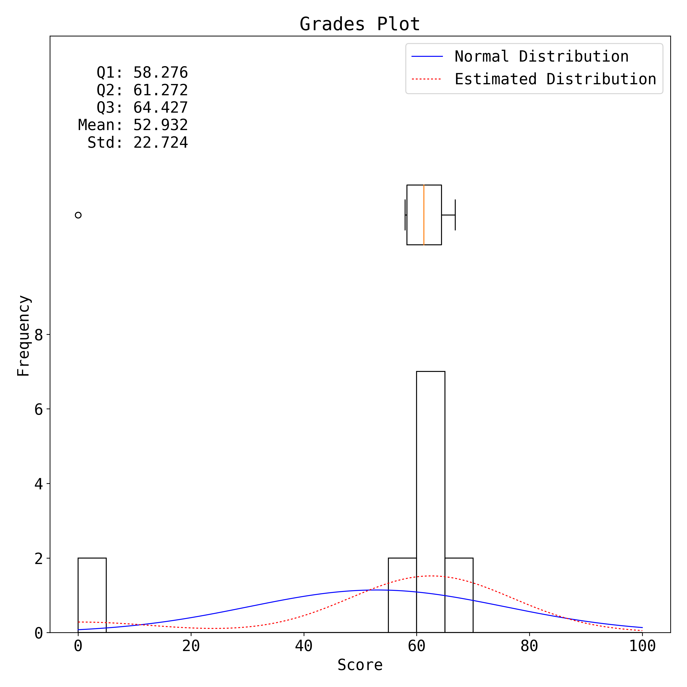

# Introduction

## Installation

=== "Python Library"

    ```bash
    pip3 install git+https://github.com/tc-imba/canvas-auto-rubric.git@master
    ```

=== "Local Install or Debugging"

    ```bash
    git clone git@github.com:tc-imba/canvas-auto-rubric.git
    cd canvas-auto-rubric
    # you can setup a virtual python env before install here
    pip3 install -e .
    ```

## Input Format

All commands shares the same [Input Format](input.md). 

Currently, only `csv` files are fully supported. Support for `xls/xlsx` files is in beta status and is not recommended to use. 

## Canvas Workflow

Please **carefully** follow the steps listed in [Canvas Workflow](workflow.md) before using the `canvasautorubric` program.


## Commands

* [`canvasautorubric`](canvasautorubric.md) - Sync the rubric on canvas.


* [`canvasautoplot`](canvasautoplot.md) - Plot the grade distribution.



## Licence        
                  
Apache 2.0        
                  
## Dependencies   
                  
* canvasapi==1.0.0
* click           
* pbr             
* logzero         
* scipy           
* pandas          
* openpyxla       
* matplotlib      
* enlighten       