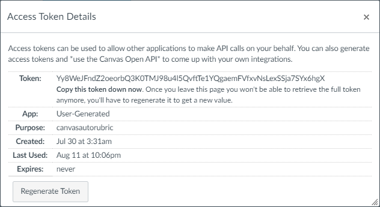

# Canvas Workflow

Please **carefully** follow the steps listed below.

## Generate Access Token

First, you need a key (called "access token") to access the resources you own on canvas.

The key can be generated in the `/profile/settings` webpage on canvas. For example, in UMJI, it is <a href="https://umjicanvas.com/profile/settings" target="_blank">https://umjicanvas.com/profile/settings</a>.

In the `Approved Integrations` section, use `New Access Token` to generate a key.

The generated key will be shown here.

It is `Yy8WeJFndZ2oeorbQ3K0TMJ98u4l5QvftTe1YQgaemFVfxvNsLexSSja7SYx6hgX`. Please keep this key secret, do not give to anyone else because it can provide the whole access to your canvas account. You need to save this key somewhere because

> Once you leave this page you won't be able to retrieve the full token anymore, you'll have to regenerate it to get a new value.

## Obtain Course and Assignment ID

Open the assignment you want to grade on canvas, you can easily find the Course ID and Assignment ID in the navbar.

For example, the url is `https://umjicanvas.com/courses/786/assignments/7081`, so the Course ID is `786` and the Assignment ID is `7081`.

## Create a Rubric (with a Rubric ID)

You can then create a rubric (or select an existing one) on the same page.

The way to get Rubric ID is a bit more tricky. Assuming that you are using Chrome, right click the name of the rubric and select `Chrome Devtools` (or `检查`, `审查元素`), the rubric id will be shown in the dev tools.

If you can't find out that the Rubric ID is `182`, please close this page and go to doctor. (CR. [Reapor-Yurnero](https://github.com/Reapor-Yurnero) when playing DoTA2
)

## Note for UM-JI Users

The version of canvas is never updated in JI. In the current version, the rubric function of canvas is a beta version, which has some bugs. 

**If a rubric is just created and never used, this tool won't work and will throw an error. You can give a random score to any student (e.g., Test Student) in an assignment using this rubric in the SpeedGrader before running this tool. Don't worry about the random score because all scores will be updated after running this tool.**